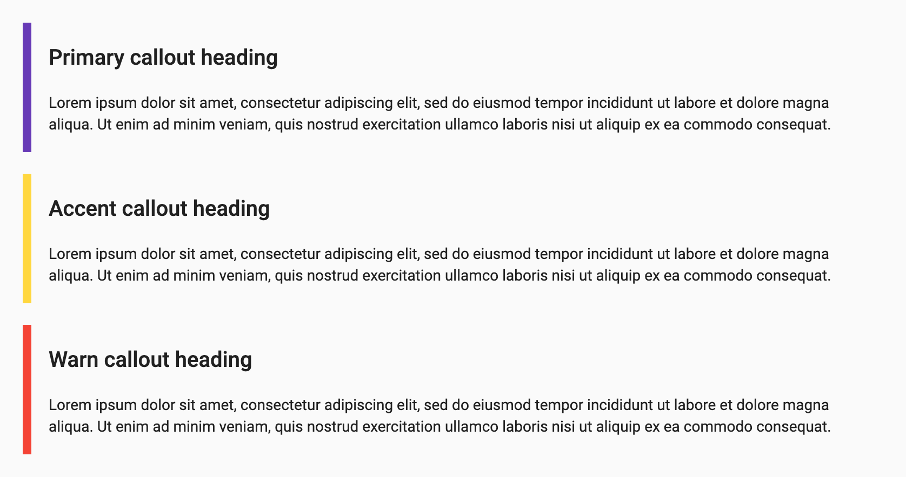

# Ngx Mat Callout

Small library that brings the callout components seen on [Bootstrap Documentation](https://getbootstrap.com/) to be used as [Angular Material](https://material.angular.io/) library components.




### Demo app
https://andreivictor.github.io/ngx-mat-callout/

### Stackblitz examples:
- Callouts overview: https://stackblitz.com/edit/angular-r7rxyl-vwdlhy

- Callouts with heading template: https://stackblitz.com/edit/angular-r7rxyl-vwdlhy

- Simple callouts (without heading): https://stackblitz.com/edit/angular-r7rxyl-vwdlhy


### Installation

Install `ngx-mat-callout` in your project:

```
npm install ngx-mat-callout --save
```

### Usage

- Import the `NgxMatCalloutModule`:
```typescript
import { NgxMatCalloutModule } from 'ngx-mat-callout';

@NgModule({
  imports: [
    // ..
    NgxMatCalloutModule
  ],

})
export class AppModule {}
```

- Start using the component `ngx-mat-callout`:
```html
<ngx-mat-callout color="primary" heading="Primary callout heading">
  <p>Lorem ipsum dolor sit amet, consectetur adipiscing elit, sed do eiusmod tempor incididunt ut labore et dolore magna aliqua.</p>
</ngx-mat-callout>
```

### Heading
If a callout's heading is plain text only, then the `heading` property can be used:
```html
<ngx-mat-callout color="primary" heading="Primary callout heading">
  ...
</ngx-mat-callout>
```

For more complex headings, add a template with the `ngxMatCalloutHeading` directive inside the `ngx-mat-callout` component:
```html
<ngx-mat-callout color="primary">
  <ng-template ngxMatCalloutHeading>
    <h1>
      <mat-icon>thumb_up</mat-icon>
      Primary <em>Heading </em> <u>with</u> <b> HTML</b>
    </h1>
  </ng-template>
  ...
</ngx-mat-callout>
```

### Theming
The color of the `<ngx-mat-callout>` component can be changed by using the `color` property.

By default, callouts use a neutral background color based on the current theme (light or dark). This can be changed to `'primary'`, `'accent'`, or `'warn'`.

### Compatibility

* `@angular/core`: `^7.0.0 || ^8.0.0 || ^9.0.0 || ^10.0.0 || ^11.0.0`,
* `@angular/material`: `^7.0.0 || ^8.0.0 || ^9.0.0 || ^10.0.0 || ^11.0.0`

### License

[MIT](/LICENSE)

# Development

This project was generated with [Angular CLI](https://github.com/angular/angular-cli) version 9.1.0.

## Development server

Run `ng serve` for a dev server. Navigate to `http://localhost:4200/`. The app will automatically reload if you change any of the source files.

## Code scaffolding

Run `ng generate component component-name` to generate a new component. You can also use `ng generate directive|pipe|service|class|guard|interface|enum|module`.

## Build

Run `ng build` to build the project. The build artifacts will be stored in the `dist/` directory. Use the `--prod` flag for a production build.

## Running unit tests

Run `ng test` to execute the unit tests via [Karma](https://karma-runner.github.io).

## Running end-to-end tests

Run `ng e2e` to execute the end-to-end tests via [Protractor](http://www.protractortest.org/).

## Further help

To get more help on the Angular CLI use `ng help` or go check out the [Angular CLI README](https://github.com/angular/angular-cli/blob/master/README.md).
